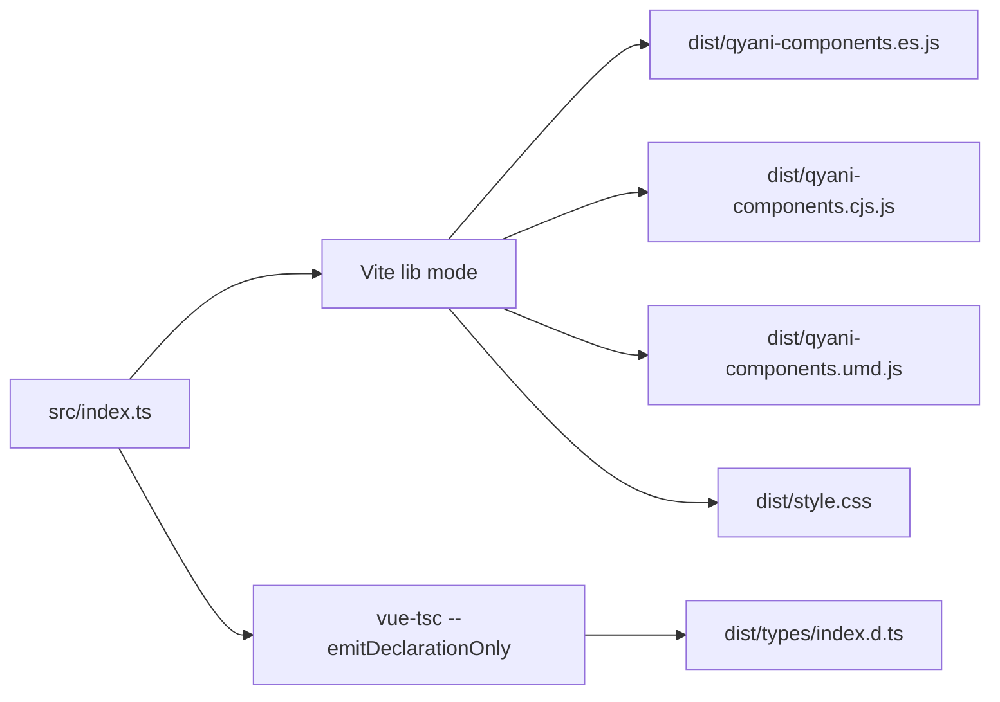

# 项目架构

## 组件库构建管线

组件库 `packages/components` 使用 Vite 库模式构建，生成多格式输出：

**关键配置**:

- 入口：`src/index.ts`
- Vue 外部化（不打包进库）
- 所有 CSS 合并为 `dist/style.css`
- `@/*` 路径别名映射到 `src/*`

**来源**: [packages/components/vite.config.ts](file://packages/components/vite.config.ts) · [packages/components/tsconfig.json](file://packages/components/tsconfig.json)

## 文档站点开发模式与 HMR

文档开发模式下，docs 通过自定义 Vite 插件将 `qyani-components` 解析到源码入口，实现代码变更时的即时热更新。

**关键机制**:

1. `resolve` 别名将 `qyani-components` 映射到 `../components/src/index.ts`
2. 自定义插件 `resolveComponentsSource` 将组件源码中的 `@/` 路径别名重写为相对路径
3. `optimizeDeps.exclude` 排除 `qyani-components`，避免预打包
4. 生产构建则使用预构建的 `dist/` 产物

**来源**: [packages/docs/vite.config.ts](file://packages/docs/vite.config.ts)

## 自动化文档生成体系

项目使用 Python 脚本实现组件文档的自动生成：

| 脚本                    | 位置                           | 功能                                      |
| ----------------------- | ------------------------------ | ----------------------------------------- |
| `init.py`               | `packages/docs/scripts/`       | 从组件源生成存根展示 .vue 和公开 .md 文档 |
| `index_python.py`       | `packages/docs/scripts/`       | 生成 ComponentDetail.vue 的异步导入       |
| `get_component_info.py` | `packages/docs/scripts/`       | 生成 useComponentInfo.ts 组件元数据       |
| `index_python.local.py` | `packages/components/scripts/` | 生成 src/index.ts 的导入注册              |
| `global.d.ts.local.py`  | `packages/components/scripts/` | 生成 global.d.ts 类型增强                 |

**特点**:

- 所有脚本输出必须**确定性**（排序的目录遍历、排序的结果）
- 新增组件应通过 Python 脚本更新，而非手动编辑

## 全局类型增强

`global.d.ts` 提供 Vue 模块增强（`declare module 'vue'`），为所有 `Q` 前缀组件声明全局类型，使消费项目无需显式导入即可获得类型安全支持。使用 `files` 字段和 `exports["./global"]` 发布。

**来源**: [packages/components/global.d.ts](file://packages/components/global.d.ts)

## 测试架构

- 测试框架：Vitest 3
- 测试位置：内联测试（组件 `__test__/composable.test.ts`，工具函数 `{name}.test.ts`）
- 类型检查隔离：主 `tsconfig.json` 通过 `exclude` 排除 `src/**/*.test.ts`，专用 `tsconfig.test.json` 独立处理测试文件类型检查（`noEmit: true`）

**来源**: [packages/components/tsconfig.json](file://packages/components/tsconfig.json) · [packages/components/tsconfig.test.json](file://packages/components/tsconfig.test.json)
